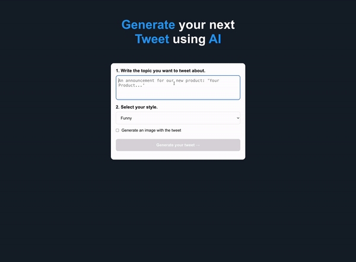

# Tweet Generator

This app generates engaging tweets for your brand.

This project is built using Nextjs. It utilizes the OpenAI GPT for chat completion, and Dall-E for image generation.



## Getting Started

First, add a `.env` file into the project, add OPEN_AI_KEY= with the value of your OpenAI key.

The first time you are running this project, you will need to install the dependencies. Run this command in your terminal:

```bash
yarn
```

To start the app, run:

```bash
yarn dev
```

Open [http://localhost:3000](http://localhost:3000) with your browser to see the result.
